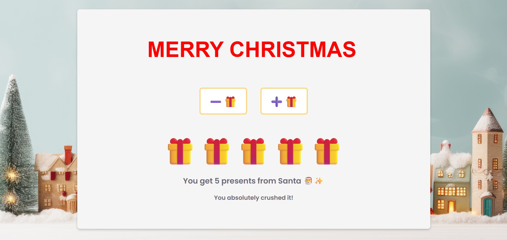

# 🎄 Merry Christmas 🎁

A simple festive web app where users can add or remove presents from Santa 🎅.
Built as a fun seasonal project with a clean UI and playful interactions.

<p align="center">
  
</p>


## 🚀 Usage

Clone the repository
```bash
git clone https://github.com/tobifotis/merry-christmas.git
```

Install dependencies

```bash
npm install
```

Run the app locally

```bash
npm run dev
```


## 🎅 Bonus meme
<p align="center">
  
</p>


